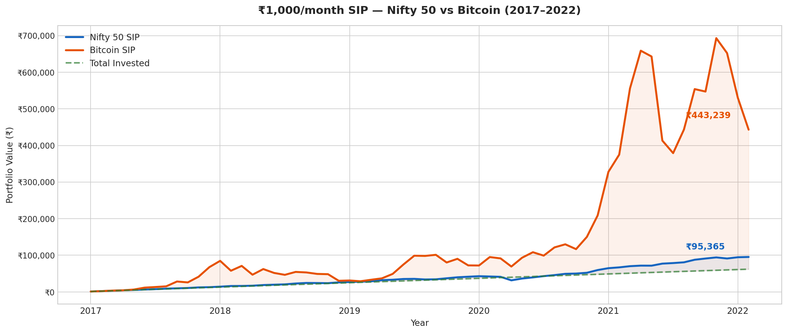
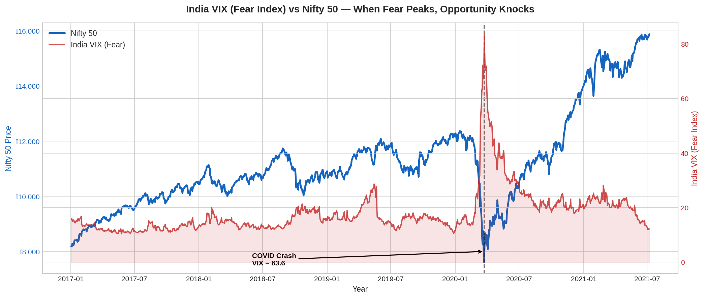
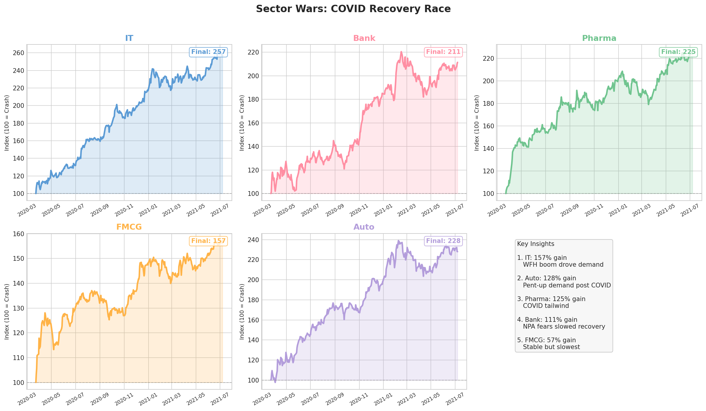

# Nifty 50 vs Bitcoin — Indian Market Analysis (2017–2022)

## About This Project
Most people ask — *"Should I invest in stocks or crypto?"*

But nobody actually sits down with real data and answers it properly.

This project does exactly that. Using 5 years of real Indian market data, 
I analyzed what would have happened if someone invested ₹1,000 every month 
in Nifty 50 vs Bitcoin — and went deeper into market fear, sector performance, 
and how different industries recovered after the COVID crash.

---

## Key Questions Answered
1. **SIP vs Crypto** — Which gave better returns over 5 years?
2. **Risk vs Reward** — How much did each crash during COVID?
3. **Fear = Opportunity?** — Does investing during panic actually work?
4. **Sector Wars** — Which sector recovered fastest after COVID crash?

---

## Key Findings

| Metric | Nifty 50 | Bitcoin |
|--------|----------|---------|
| Total Invested | ₹62,000 | ₹62,000 |
| Final Value | ₹95,365 | ₹4,43,239 |
| Returns | 54% | 615% |
| COVID Crash | -45.6% | -83.3% |
| Recovery Time | 9 months | 9 months |

**Sector Performance from COVID Crash Bottom:**
| Sector | Gain |
|--------|------|
| IT | +157% |
| Auto | +128% |
| Pharma | +125% |
| Bank | +111% |
| FMCG | +57% |

---

## Visualizations

### 1. SIP Comparison — Nifty 50 vs Bitcoin (2017–2022)
*₹1,000/month invested consistently — where did it grow more?*

### 2. India VIX (Fear Index) vs Nifty 50
*When everyone is scared — is it actually the best time to invest?*

### 3. Sector Wars — COVID Recovery Race
*Not all sectors are equal — who bounced back the fastest?*

---

## Tools & Technologies
| Tool | Purpose |
|------|---------|
| Python | Core programming language |
| Pandas | Data cleaning and manipulation |
| Matplotlib | Data visualization |
| Seaborn | Plot styling |
| Google Colab | Development environment |

---

## How to Run
1. Open `Nifty_Bitcoin_SIP_Market_Analysis.ipynb` in Google Colab
2. Download datasets from links below and upload to Google Drive
3. Run all cells in order

---

## Dataset Sources
- [Nifty Indices Dataset — Kaggle](https://www.kaggle.com/datasets/sudalairajkumar/nifty-indices-dataset)
- [Bitcoin Historical Data — Kaggle](https://www.kaggle.com/datasets/prasoonkottarathil/btcinusd)

---

## Conclusions
- **Bitcoin gave 7x more returns** than Nifty — but crashed 2x harder
- **Fear = Opportunity** — VIX spiked to 83.6 during COVID, market doubled after
- **Sector selection matters** — IT gave 157% while FMCG gave only 57% in same period
- **SIP consistency beats timing** — ₹62,000 became ₹95,365 without any market prediction

---

*Made with real NSE India data | 2nd Year CSE Student Project*
